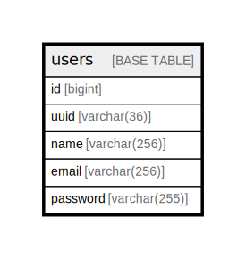

# users

## Description

<details>
<summary><strong>Table Definition</strong></summary>

```sql
CREATE TABLE `users` (
  `id` bigint NOT NULL AUTO_INCREMENT,
  `uuid` varchar(36) COLLATE utf8mb4_0900_bin NOT NULL,
  `name` varchar(256) COLLATE utf8mb4_0900_bin NOT NULL,
  `email` varchar(256) COLLATE utf8mb4_0900_bin NOT NULL,
  `password` varchar(255) COLLATE utf8mb4_0900_bin NOT NULL,
  PRIMARY KEY (`id`),
  UNIQUE KEY `uuid` (`uuid`),
  UNIQUE KEY `email` (`email`)
) ENGINE=InnoDB DEFAULT CHARSET=utf8mb4 COLLATE=utf8mb4_0900_bin
```

</details>

## Columns

| Name | Type | Default | Nullable | Extra Definition | Children | Parents | Comment |
| ---- | ---- | ------- | -------- | ---------------- | -------- | ------- | ------- |
| id | bigint |  | false | auto_increment |  |  |  |
| uuid | varchar(36) |  | false |  |  |  |  |
| name | varchar(256) |  | false |  |  |  |  |
| email | varchar(256) |  | false |  |  |  |  |
| password | varchar(255) |  | false |  |  |  |  |

## Constraints

| Name | Type | Definition |
| ---- | ---- | ---------- |
| email | UNIQUE | UNIQUE KEY email (email) |
| PRIMARY | PRIMARY KEY | PRIMARY KEY (id) |
| uuid | UNIQUE | UNIQUE KEY uuid (uuid) |

## Indexes

| Name | Definition |
| ---- | ---------- |
| PRIMARY | PRIMARY KEY (id) USING BTREE |
| email | UNIQUE KEY email (email) USING BTREE |
| uuid | UNIQUE KEY uuid (uuid) USING BTREE |

## Relations



---

> Generated by [tbls](https://github.com/k1LoW/tbls)
